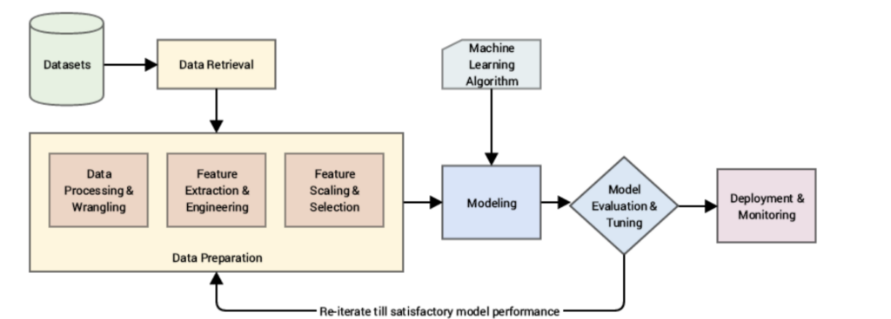
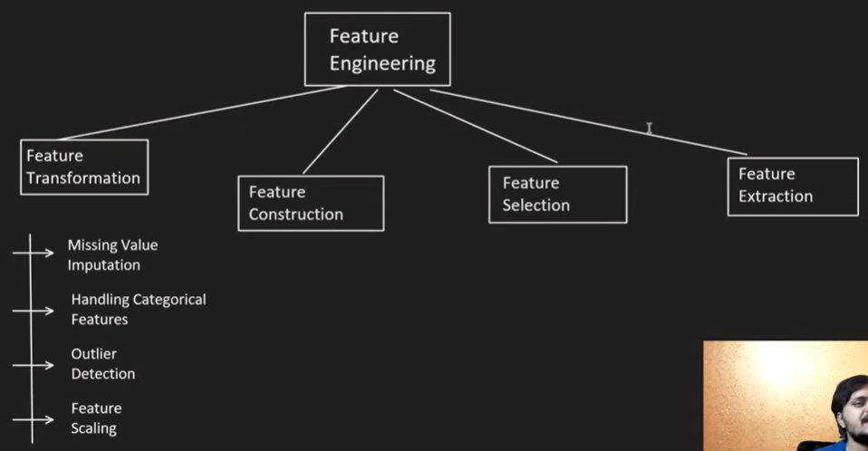

Feature engineering is a critical part of the machine learning pipeline where you create new input features from existing data to improve model performance. Here’s a comprehensive overview of feature engineering and some common techniques:

### What is Feature Engineering?

Feature engineering involves creating new features or modifying existing ones to make machine learning algorithms work better. It aims to:

1. **Capture Relevant Information**: Create features that encode domain knowledge and relationships within the data.
2. **Improve Model Performance**: Provide more informative inputs to machine learning algorithms.
3. **Prepare Data**: Ensure data is in a suitable format for machine learning algorithms.

### Common Feature Engineering Techniques

1. **Imputation**: Handling missing data by filling in missing values using techniques like mean, median, or mode imputation.
   
2. **Normalization and Scaling**: Bringing numerical features to a similar scale, such as Min-Max scaling or standardization (z-score scaling).

3. **Encoding Categorical Variables**: Converting categorical variables into numerical representations suitable for machine learning models. Techniques include one-hot encoding, label encoding, or target encoding.

4. **Feature Extraction**: Creating new features from existing ones, like extracting date components (day, month, year) from datetime features, or extracting text features (e.g., word counts, TF-IDF).

5. **Transformations**: Applying mathematical transformations to numerical features to make their distribution more suitable for modeling. Examples include logarithmic transformation or Box-Cox transformation.

6. **Binning**: Grouping numerical data into bins or intervals to simplify the relationship between the feature and the target variable.

7. **Feature Selection**: Identifying and selecting the most relevant features to improve model performance and reduce overfitting. Techniques include statistical tests, feature importance from models, or recursive feature elimination.

8. **Interaction Features**: Creating new features by combining existing ones to capture interactions or relationships between them. For example, product or ratio features.

### Example Workflow

Here’s a simplified workflow for feature engineering:

- **Data Understanding**: Understand the data and its characteristics, including distributions, relationships, and missing values.
  
- **Feature Generation**: Create new features based on domain knowledge or insights from exploratory data analysis (EDA).
  
- **Feature Transformation**: Transform existing features to meet modeling assumptions (e.g., scaling, encoding).
  
- **Feature Selection**: Select the most relevant features using techniques like correlation analysis, feature importance ranking, or model-based selection.

- **Validation**: Validate the engineered features through cross-validation or other validation techniques to ensure they improve model performance.

### Importance of Domain Knowledge

Domain knowledge plays a crucial role in feature engineering because it helps in creating meaningful features that can capture nuances and patterns specific to the problem domain. It’s essential to collaborate with domain experts to understand the data better and extract relevant features effectively.

By carefully engineering features, you can enhance the predictive power of your machine learning models and make them more robust to new data. If you have specific questions about applying feature engineering techniques to your data or need further clarification, feel free to ask!

# Steps: 

## 1. Transformation
  - Missing value Implutation
  - Handling Categorical Featues(one-hot encoding, label encoding, or target encoding)
  - Outlier Detection
  - Scaling [Standardization (Z-score Normalization)
Min-Max Scaling (Normalization)
Robust Scaling
Normalization]
## 2. Construction
1
1
1

11
1

1
1
1
11
1
1

1
1
1
1
1
1
1
11

1

1

1

1

11
11
11
1
1
1
1
1
1

1
1

1
1

11

1
1
1
11

1
1
1
1
1
1

1

1

1
1
1
1
1
11
1
1
1
1
1

1
11
1
1
11

1
11
1

1
1

1

Feature scaling techniques are used to standardize the range or distribution of features in your dataset. This process is crucial in many machine learning algorithms because it ensures that all features contribute equally to the model training process. Here are some common feature scaling techniques:

1. Standardization (Z-score Normalization)
Standardization transforms data to have a mean of 0 and a standard deviation of 1. It's suitable when the data follows a Gaussian distribution (normal distribution).

Advantages: Does not bound values to a specific range, which can be beneficial for algorithms that assume Gaussian distribution.

Disadvantages: Sensitive to outliers since it's based on mean and standard deviation.

2. Min-Max Scaling
Min-Max scaling (Normalization) transforms data to a fixed range, often [0, 1]. It's suitable when the data does not necessarily follow a Gaussian distribution and is bounded.

Advantages: Preserves the shape of the original distribution and is simple to understand and implement.

Disadvantages: Sensitive to outliers if the range is not robust to outliers.

3. Robust Scaling
Robust scaling is similar to Min-Max scaling but uses the interquartile range (IQR) instead of the min-max values. It's less sensitive to outliers.

Advantages: Less sensitive to outliers compared to Min-Max scaling.

Disadvantages: Like Min-Max scaling, the transformed data is not centered at zero and may not be suitable for algorithms that expect zero-centered data.

4. Normalization
Normalization scales each data point such that the feature vector has a Euclidean length of 1. It's often used in algorithms that involve distance calculations, such as K-Nearest Neighbors (KNN) and Neural Networks.

Advantages: Ensures all features have the same scale.

Disadvantages: Changes the shape of the original distribution and does not address the issue of differing ranges among features.

Choosing the Right Technique
Standardization is generally recommended when the data is normally distributed or when the algorithm does not make assumptions about the distribution of the data.

Min-Max Scaling is useful when the algorithm requires features to be on the same scale or when interpreting feature importance based on coefficients or weights.

Robust Scaling is beneficial when dealing with datasets with outliers that can skew the min-max scaling.

Normalization is suitable for algorithms that rely on distance measures, such as clustering algorithms.

